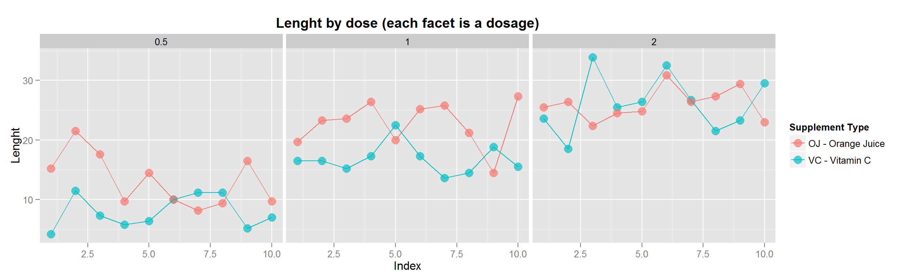

# Statistical Inference Project - ToothGrowth
Diego Gaona  
19 de agosto de 2015  

The objective is to explore and analyze the ToothGrowth data and compare tooth growth by supp and dose.  
The data shows the Effect of Vitamin C on Tooth Growth in Guinea Pigs.
The response is the length of odontoblasts (cells responsible for tooth growth) in 60 guinea pigs. Each animal received one of three dose levels of vitamin C (0.5, 1, and 2 mg/day) by one of two delivery methods, Orange Juice (coded as OJ) or ascorbic acid (a form of Vitamin C and coded as VC)

**Loading the data**  
The ToothGrowth is part of the R datasets package, and now I load the data in the "datat" data frame.

```r
datat <- ToothGrowth
```

**Exploring the data**  
Now I explore the data with 2 plots (the code to the plots are in Appendix section (and the transformations in the data for the plot 2). In this boxplot we see the differences bettween the dosages by the supplement type. We can see big differences between the dosage amount, when the dosage is bigger, the tooth is longer . Between the supplement types, we can see when the dosage is 2 mg/day, the OJ and VC are not so different, but in the other 2 dosages, the differences are clear (the data  of dosage 0.5 and 1 mg/day of OJ shows tooths longer than with VC) .  
 

In the plot bellow, we can see the data points by supplement type (by color) and dosage (by facet).
I created a index in the data to get a more clearly view of the data points. This plots confirm the assumptions of the plot above, and now we can see the difference between each data point.
 

**Basic summary of the data**  
Now we see a basic numeric summary of the data:  

```r
summary(datat)
```

```
##       len        supp         dose      
##  Min.   : 4.20   OJ:30   Min.   :0.500  
##  1st Qu.:13.07   VC:30   1st Qu.:0.500  
##  Median :19.25           Median :1.000  
##  Mean   :18.81           Mean   :1.167  
##  3rd Qu.:25.27           3rd Qu.:2.000  
##  Max.   :33.90           Max.   :2.000
```
**Performing hypothesis tests**  
I do the hypotheis tests by supplement type and after by supplement type and dosage. The t.test comparing the ToothGrowth data by supplement (all dosages):

```r
t.test(len~supp, data = datat)
```

```
## 
## 	Welch Two Sample t-test
## 
## data:  len by supp
## t = 1.9153, df = 55.309, p-value = 0.06063
## alternative hypothesis: true difference in means is not equal to 0
## 95 percent confidence interval:
##  -0.1710156  7.5710156
## sample estimates:
## mean in group OJ mean in group VC 
##         20.66333         16.96333
```

To do the other t.tests I subset the data by dosage (using datap2, the data used to do the plot2, only to make the subset more simple)

```r
data05 <- datap2[1:20,1:3] ## subset the data with dose = 0.5
data1 <- datap2[21:40,1:3] ## subset the data with dose = 1
data2 <- datap2[41:60,1:3] ## subset the data with dose = 2
```


```r
t.test(len~supp, data = data05) ## The t.test between supplements for 0.5mg/day
```

```
## 
## 	Welch Two Sample t-test
## 
## data:  len by supp
## t = 3.1697, df = 14.969, p-value = 0.006359
## alternative hypothesis: true difference in means is not equal to 0
## 95 percent confidence interval:
##  1.719057 8.780943
## sample estimates:
## mean in group OJ mean in group VC 
##            13.23             7.98
```


```r
t.test(len~supp, data = data1) ## The t.test between supplements for 1mg/day
```

```
## 
## 	Welch Two Sample t-test
## 
## data:  len by supp
## t = 4.0328, df = 15.358, p-value = 0.001038
## alternative hypothesis: true difference in means is not equal to 0
## 95 percent confidence interval:
##  2.802148 9.057852
## sample estimates:
## mean in group OJ mean in group VC 
##            22.70            16.77
```


```r
t.test(len~supp, data = data2) ## The t.test between supplements for 2mg/day
```

```
## 
## 	Welch Two Sample t-test
## 
## data:  len by supp
## t = -0.0461, df = 14.04, p-value = 0.9639
## alternative hypothesis: true difference in means is not equal to 0
## 95 percent confidence interval:
##  -3.79807  3.63807
## sample estimates:
## mean in group OJ mean in group VC 
##            26.06            26.14
```

##Conclusion  
**Null Hypothesis (H0):** There is no difference in the mean tooth lenght for orange juice vs ascorbic acid, they have the same effect on tooth growth.
**Alternative Hypothesis (Ha):** There is difference in the mean tooth lenght for orange juice vs ascorbic acid, they have the same effect on tooth growth.
For the tests for all dosages, we can't reject the null hypothesis with alpha 0.05mg/day,  because we have a p-value = 0.06063, there is no significant difference between supplements types.
How we have assume by the plots, in the data with dosage 0.5 and 1mg/day, we have a very low p-value and we can reject the null hypothesis, in this dosages the orange juice is significant more effective in tooth growth.
However, with doses 2mg/day, as we have suppose by the plots, we can't reject the null hypothesis, we have a high p-value and very near means, therefore the 2 supplements have not significative difference in the tooth growth with a 2mg dosage.
By the exploratory plots, we can assume that independent of the supplement, greater doses have is related with growth of the tooths.

##Appendix  
The code for the boxplot:  

```r
box1 <- ggplot(datat, aes(x = factor(dose), y = len, fill = factor(dose))) +
      geom_boxplot() + 
      facet_grid(.~supp) + 
      ggtitle(expression(bold("Boxplots of ToothGrowth data"))) +
      ylab("Lenght") +  xlab("Dosage") + 
      scale_fill_discrete(name="Dosage")
box1
```

The code for the plot2  

```r
datap2 <- datat
datap2$index <- as.numeric(paste(c(01:10,21:30,41:50,11:20,31:40,51:60))) ## Created to get a better view in the plot
datap2$index <- sprintf("%02d",datap2$index) ## Add 0 before number 1:10 to do a correct order
datap2 <- datap2[order(datap2$index),]
datap2$index <- as.numeric(paste(c(01:10,01:10,01:10,01:10,01:10,01:10))) ## Change the index, only to get a better view to Graphic
p2 <- ggplot(datap2, aes(x = index, y = len, colour = supp)) + ## Initializes ggplot object) 
      geom_point(stat = "identity", size = 4, alpha = .7) +
      geom_line(stat = "identity") +
      facet_grid(.~dose) +
      ylab("Lenght") +  xlab("Index") +
      ggtitle(expression(bold("Lenght by dose (each facet is a dosage)"))) +
      scale_colour_discrete(name="Supplement Type", labels=c("OJ - Orange Juice", "VC - Vitamin C"))
p2
```
